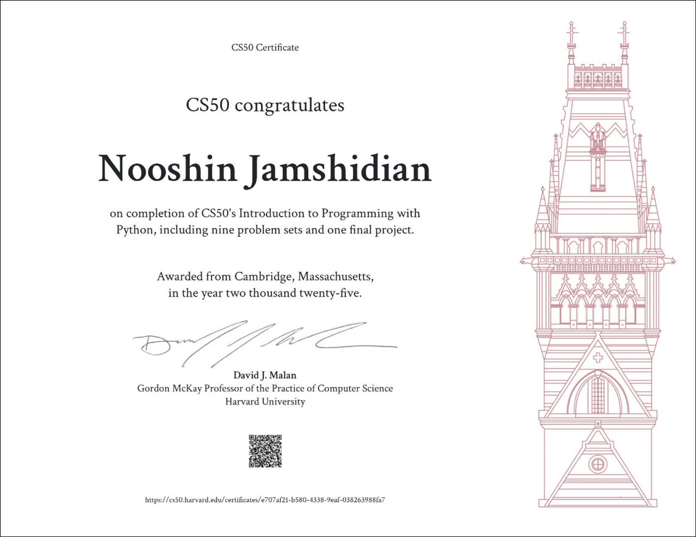

##  CS50P — Introduction to Programming with Python

Welcome to my CS50P repository — a complete collection of weekly problem sets and projects from Harvard’s Introduction to Programming with Python.
All solutions were developed and tested using the official CS50 Duck IDE environment. 💻

---

##  Overview

This repository contains my personal implementations of the weekly assignments from the CS50P course.
Each folder represents one week of the curriculum and includes exercises, problem sets, and sometimes additional notes or test files.
All code was written and tested in CS50 Duck IDE to ensure full compatibility with tools like check50, submit50, and style50.

---

## 📁 Repository Structure

CS50P/
├── [week0/](./week0)
├── [week1/](./week1)
├── [week2/](./week2)
├── [week3/](./week3)
├── [week4/](./week4)
├── [week5/](./week5)
├── [week6/](./week6)
├── [week7/](./week7)
├── [week8/](./week8)
└── [final_project/](./final_project)

Each directory contains the solutions for that specific week.
Additional files (like test scripts or datasets) are included where needed.

---

##  Weekly Topics

Week	Title	Main Concepts
- 0	Functions & Variables	Basics, I/O, Conditionals
- 1	Loops	For/While loops, Control Flow
- 2	Strings	Manipulation, Methods, Validation
- 3	Exceptions	Error Handling, Defensive Programming
- 4	Libraries	Importing, Using External Packages
- 5	Unit Tests	Testing with pytest
- 6	File I/O	Working with Files, CSV, JSON
- 7	Regular Expressions	Pattern Matching, Validation
- 8	Object-Oriented Programming	Classes, Encapsulation, Methods
- Final	Final Project	Integrating All Concepts

---

Learning Outcomes

By completing this course, I’ve developed the ability to:
Think algorithmically and write efficient Python code.
Design modular and reusable functions.
Apply object-oriented principles.
Use libraries and external modules effectively.
Write and run automated tests.
Handle files, data, and exceptions gracefully.

---

##  Development Environment

All work was done using the CS50 Duck IDE, which includes:

Python 3.x

Built-in CS50 tools (check50, submit50, style50)

Git integration for version control

---

##  Purpose

This repository documents my journey through the CS50P course — a foundational step toward mastering Python programming and preparing for more advanced CS and AI concepts.

---

##  License

This repository follows the CS50 Academic Honesty policy.
Code and solutions are for educational and reference purposes only.

---

## 🏅 CS50P Certificate

